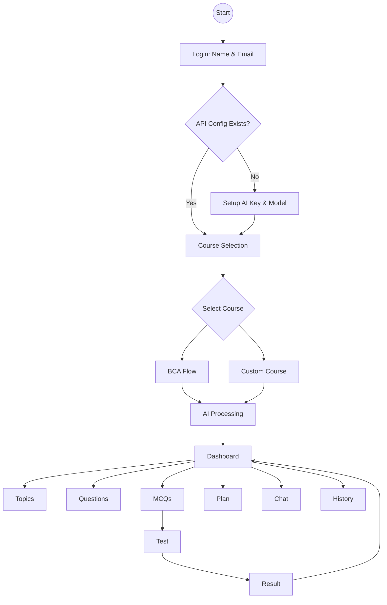

# 📚 Upgrade Your Study 🚀

An advanced AI-powered study assistant platform that helps students generate topics, questions, MCQs, and structured study plans — powered by a full-stack architecture with MongoDB backend and intelligent AI processing.

---

## 🌐 Live Demo

🔗 https://upgrade-your-study.netlify.app/

---

## 🧠 Core Idea

Upgrade Your Study is designed to simplify learning by combining **AI-powered content generation** with **structured backend systems** and **real-time data handling**, making it a complete smart study ecosystem.

---

## ⚡ Key Features

### 🤖 AI-Powered Learning

* Generate important topics from syllabus
* Create expected exam questions
* Auto-generate MCQs
* Build structured 7-day study plans

---

### 📊 Smart Dashboard

* Central learning hub
* Organized study content
* Easy navigation between topics, questions, and plans

---

### 🧪 Skill Testing System

* MCQ-based quiz system
* Instant score and feedback
* Performance tracking

---

### 💬 AI Chat Assistant

* Ask doubts in real-time
* Upload images for solutions
* Smart AI-based responses

---

### 📚 Course-Based System

* BCA (DDU GKP) structured flow
* Custom course support
* Subject-wise analysis

---

### 📜 History Tracking

* Saves previous analysis
* Helps in revision and continuity

---

## 🏗️ System Architecture



---

## 🛠️ Tech Stack

### Frontend:

* HTML
* CSS
* JavaScript

### Backend:

* Node.js
* Express.js

### Database:

* MongoDB

### AI Integration:

* Gemini API

---

## 📂 Project Structure

```bash
upgrade-your-study/
│── assets/
│── backend/        # Node.js + Express server
│── css/
│── js/
│── data/
│── index.html
│── package.json
│── netlify.toml
│── render.yaml
```

---

## 🚀 How to Run Locally

1. Clone the repository

```bash
git clone https://github.com/HarshPandey001/upgrade-your-study.git
```

2. Navigate to project

```bash
cd upgrade-your-study
```

3. Install dependencies

```bash
npm install
```

4. Start backend server

```bash
node backend/server.js
```

5. Open frontend

* Open `index.html` in browser

---

## 🔥 Future Enhancements

* User authentication system
* Cloud deployment for backend
* Personalized AI recommendations
* Mobile app version

---

## 👨‍💻 Developer

**Harsh Pandey**

---

## 💡 About

This project demonstrates a real-world full-stack application combining **AI + Backend + Database**, designed to improve student productivity and learning efficiency.

---

## ⭐ Support

If you like this project, give it a ⭐ on GitHub!
